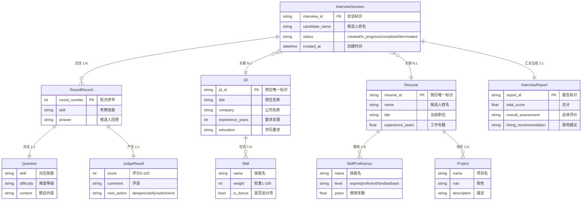
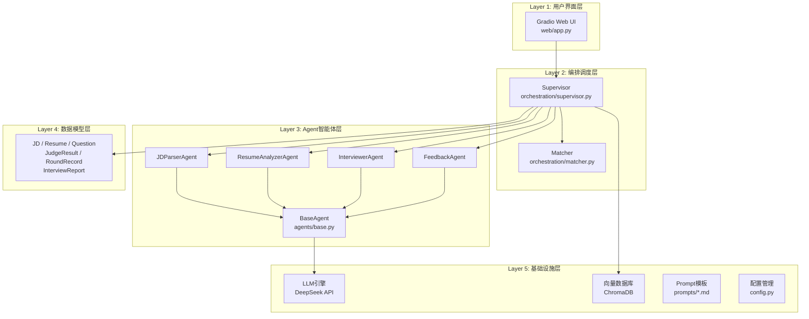
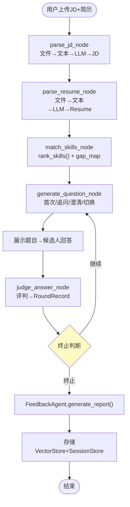
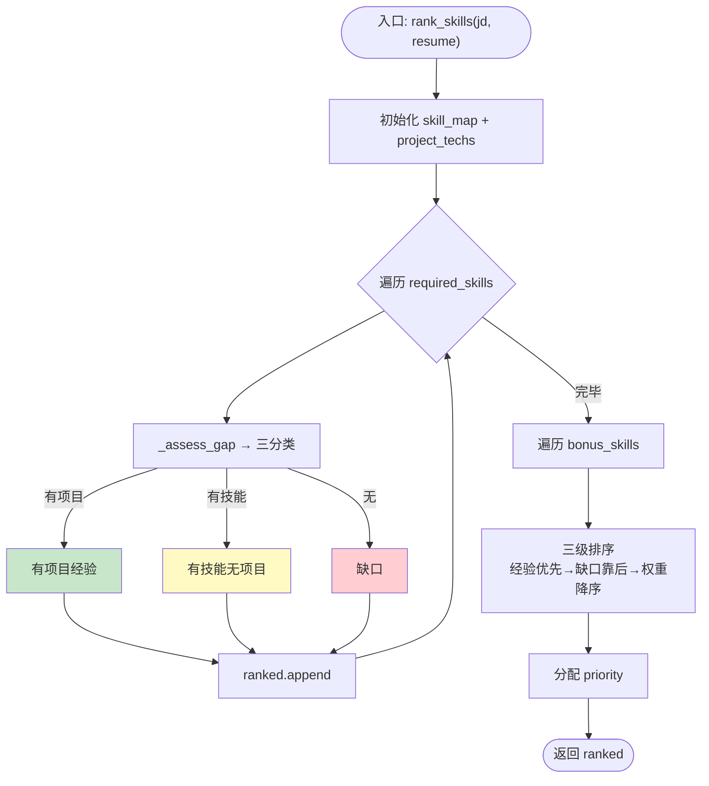
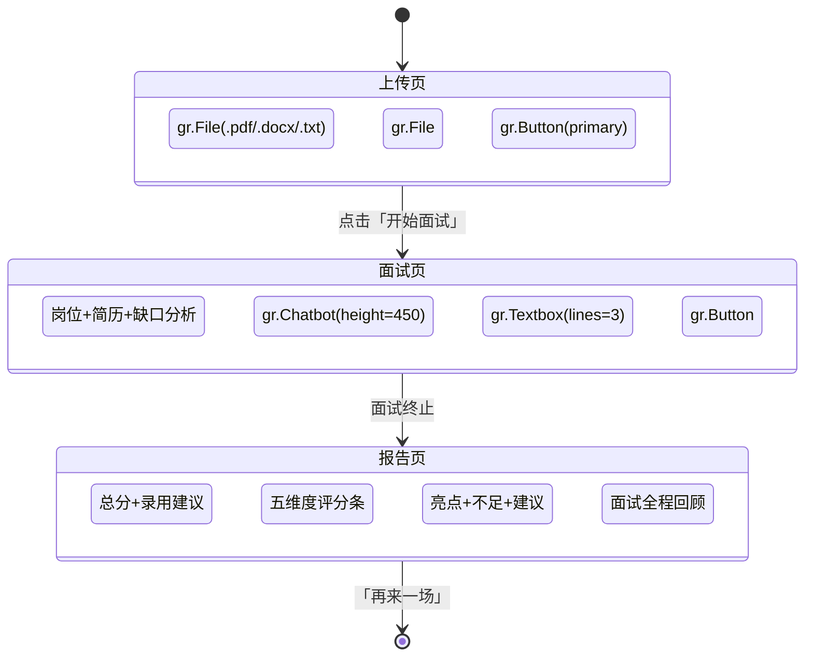
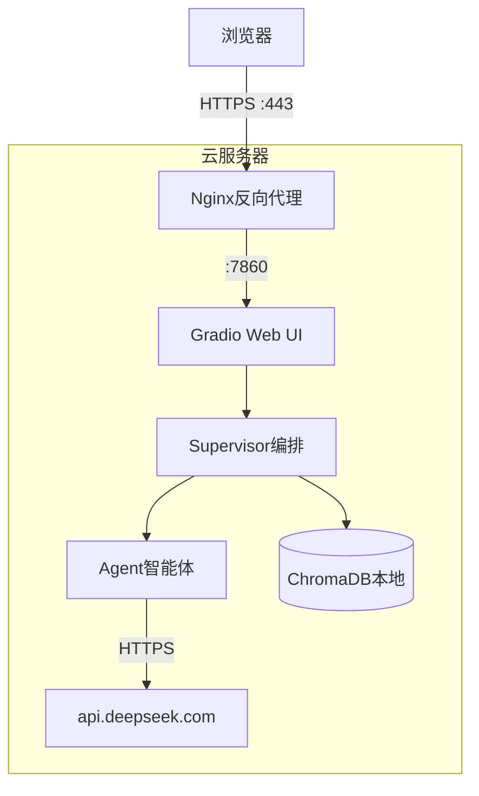

# AI 面试官系统 — 结构化系统设计（数据流角度）

---

## 一、数据设计

### 1.1 E-R 实体关系图



### 1.2 数据库表设计

**表 1：面试会话表（JSON 文件存储）**

| 字段名            | 类型         | 约束        | 说明                                           |
| ----------------- | ------------ | ----------- | ---------------------------------------------- |
| interview_id      | String(8-32) | PRIMARY KEY | UUID 十六进制                                  |
| candidate_name    | String(50)   | NOT NULL    | 候选人姓名                                     |
| status            | Enum         | NOT NULL    | created / in_progress / completed / terminated |
| jd_json           | JSON         | NOT NULL    | 结构化 JD 对象                                 |
| resume_json       | JSON         | NOT NULL    | 结构化 Resume 对象                             |
| gap_analysis_json | JSON         | —           | 技能缺口分析                                   |
| rounds_json       | JSON Array   | —           | 面试轮次数组                                   |
| current_round     | Integer      | DEFAULT 0   | 当前轮次序号                                   |
| created_at        | DateTime     | NOT NULL    | 创建时间                                       |
| updated_at        | DateTime     | NOT NULL    | 最后更新时间                                   |

**表 2：面试记录表（ChromaDB: ih_interview_sessions）**

| 字段名                  | 类型       | 说明                    |
| ----------------------- | ---------- | ----------------------- |
| id                      | String     | 面试 ID                 |
| document                | String     | 面试记录全文 JSON       |
| embedding               | Float[1024] | bge-m3 模型 1024 维语义向量（SiliconFlow API） |
| metadata.interview_id   | String     | 面试 ID                 |
| metadata.candidate_name | String     | 候选人姓名              |
| metadata.jd_title       | String     | 岗位名称                |
| metadata.round_count    | Integer    | 轮次数                  |
| metadata.total_score    | Float      | 总分                    |

**表 3：题库表（ChromaDB: ih_question_bank）**

| 字段名              | 类型       | 说明                    |
| ------------------- | ---------- | ----------------------- |
| id                  | String(8)  | UUID                    |
| document            | String     | 题目完整文本            |
| embedding           | Float[1024] | bge-m3 模型 1024 维语义向量（SiliconFlow API） |
| metadata.skill      | String     | 考察技能                |
| metadata.difficulty | String     | 难度等级                |

---

## 二、总体设计

### 2.1 软件模块层次图



**模块层次树：**

```
InterviewAgentHub
├── web/app.py                      # Gradio Blocks Web UI
├── orchestration/
│   ├── supervisor.py               # LangGraph 状态机编排
│   └── matcher.py                  # 技能匹配排序算法
├── agents/
│   ├── base.py                     # Agent基类（LLM调用/JSON解析/重试/流式）
│   ├── jd_parser.py                # JD解析Agent
│   ├── resume_analyzer.py          # 简历分析Agent
│   ├── interviewer.py              # 面试官Agent（出题/追问/评判）
│   └── feedback.py                 # 反馈Agent（报告生成）
├── models/
│   ├── jd.py / resume.py           # 实体模型
│   ├── question.py                 # 面试相关模型
│   ├── interview.py                # 会话状态模型
│   └── llm.py                      # DeepSeek API封装
├── memory/vector_store.py          # ChromaDB向量存储
├── prompts/*.md                    # Prompt模板
└── config.py                       # 全局配置
```

### 2.2 模块功能与接口描述（改进 IPO 图）

**模块一：JDParserAgent**

| 要素     | 内容                                                                                                                                                                |
| -------- | ------------------------------------------------------------------------------------------------------------------------------------------------------------------- |
| 功能     | 将岗位描述原始文本通过 LLM 解析为结构化 JD 数据                                                                                                                     |
| 输入(I)  | `jd_text: str`（原始 JD 文本，最大 3000 字符）                                                                                                                      |
| 处理(P)  | ① 输入截断 → ② 加载 jd_parser.md Prompt → ③ 调用 BaseAgent.run()（temperature=0.3）→ ④ 多策略 JSON 提取（直接 → 代码块 → 大括号）→ ⑤Pydantic 校验 → ⑥ 保留 raw_text |
| 输出(O)  | `JD`对象：title, company, required_skills[], bonus_skills[], experience_years, education, raw_text                                                                  |
| 异常处理 | LLM 失败指数退避重试 3 次（1s→2s→4s），最终抛 RuntimeError                                                                                                          |

**模块二：ResumeAnalyzerAgent**

| 要素    | 内容                                                                                                         |
| ------- | ------------------------------------------------------------------------------------------------------------ |
| 功能    | 将候选人简历文本通过 LLM 解析为结构化 Resume 数据                                                            |
| 输入(I) | `resume_text: str`（最大 3000 字符）                                                                         |
| 处理(P) | ① 输入截断 → ② 加载 resume_analyzer.md Prompt → ③ 调用 BaseAgent.run() → ④ 多策略 JSON 提取 → ⑤Pydantic 校验 |
| 输出(O) | `Resume`对象：name, title, skills[], projects[], experience_years, education, raw_text                       |

**模块三：Matcher 技能匹配器**

| 要素    | 内容                                                                                                                                                                                         |
| ------- | -------------------------------------------------------------------------------------------------------------------------------------------------------------------------------------------- |
| 功能    | JD 技能与简历技能交叉对比，生成缺口分析并按优先级排序                                                                                                                                        |
| 输入(I) | `jd: JD`, `resume: Resume`                                                                                                                                                                   |
| 处理(P) | ① 构建索引（skill_map + project_techs）→ ② 遍历 required_skills 调用\_assess_gap()三分类 → ③ 遍历 bonus_skills 标记 is_bonus → ④ 三级排序（经验优先 → 缺口靠后 → 权重降序）→ ⑤ 分配 priority |
| 输出(O) | `ordered_skills: list[dict]`，每项含 skill, weight, level, gap, reason, priority                                                                                                             |

**模块四：InterviewerAgent**

| 要素    | 内容                                                                                                                                    |
| ------- | --------------------------------------------------------------------------------------------------------------------------------------- |
| 功能    | 面试官核心引擎——出题、追问、评判                                                                                                        |
| 输入(I) | 出题：jd, resume, target_skill, difficulty, intent；评判：question, answer                                                              |
| 处理(P) | ① 构建上下文 → ② 检索历史题库（避免重复）→ ③ 检索候选人历史（个性化）→ ④ 加载 Prompt → ⑤ 调用 LLM → ⑥ 解析结构化输出 → ⑦ 新题写入向量库 |
| 输出(O) | Question（skill, difficulty, content, expected_points[]）、JudgeResult（score 0-100, comment, next_action）                             |
| 子模式  | deepen 追问（难度+1）、clarify 澄清（难度不变）、switch 切换（新技能基础题）                                                            |

**模块五：FeedbackAgent**

| 要素    | 内容                                                                                                                    |
| ------- | ----------------------------------------------------------------------------------------------------------------------- |
| 功能    | 汇总面试全流程，生成五维度评估报告含录用建议                                                                            |
| 输入(I) | `jd: JD, resume: Resume, rounds: list`                                                                                  |
| 处理(P) | ①_build_transcript()构建面试文本 → ② 加载 feedback Prompt → ③ 调用 LLM → ④ 解析为 InterviewReport                       |
| 输出(O) | InterviewReport：total_score, dimension_scores{5 维度}, strengths[], weaknesses[], suggestions[], hiring_recommendation |

**模块六：Supervisor 编排调度器**

| 要素    | 内容                                                                                                                        |
| ------- | --------------------------------------------------------------------------------------------------------------------------- |
| 功能    | 基于 LangGraph 的 DAG 编排器，管理面试全生命周期状态流转                                                                    |
| 输入(I) | `jd_path: str, resume_path: str, answers: list[str]?`                                                                       |
| 处理(P) | 6 节点串行+条件循环：parse_jd → parse_resume → match_skills → generate_question ⇄ judge_answer → decide_next → [循环或 END] |
| 输出(O) | 最终 InterviewState：rounds[], report, terminated=true                                                                      |

---

## 三、详细设计

### 3.1 面试主流程程序流程图



### 3.2 技能匹配算法 PAD 图



### 3.3 JSON 多策略解析 PAD 图

````mermaid
flowchart TD
    S(["text + model_class"])
    S --> A{"策略1: 直接JSON解析?"}
    A -->|"成功"| OK1([返回])
    A -->|"失败"| B{"策略2: ```json代码块?"}
    B -->|"命中"| B1{"解析?"}
    B1 -->|"成功"| OK2([返回])
    B1 -->|"失败"| C
    B -->|"未命中"| C{"策略3: 大括号{...}?"}
    C -->|"命中"| C1{"解析?"}
    C1 -->|"成功"| OK3([返回])
    C1 -->|"失败"| ERR
    C -->|"未命中"| ERR["抛出ValueError"]
    style ERR fill:#ffcdd2
````

### 3.4 核心算法代码实现

````python
def _assess_gap(skill, skill_map, project_techs):
    """单个技能的缺口状态——三分类判断"""
    key = skill.name.lower()
    if key in skill_map:                    # 简历有该技能
        rs = skill_map[key]
        if key in project_techs:            # 项目用过
            return rs.level, "有项目经验", "有项目实践"
        return rs.level, "有技能无项目", "无项目实践"
    return "未提及", "缺口", "简历未提及"    # 简历无该技能


def rank_skills(jd, resume):
    """JD技能按面试考察优先级排序"""
    skill_map = {s.name.lower(): s for s in resume.skills}
    project_techs = set()
    for p in resume.projects:
        for t in p.tech_stack:
            project_techs.add(t.lower())

    ranked = []
    for skill in jd.required_skills:
        level, gap, reason = _assess_gap(skill, skill_map, project_techs)
        ranked.append({...})

    for skill in jd.bonus_skills:
        level, gap, reason = _assess_gap(skill, skill_map, project_techs)
        ranked.append({..., "is_bonus": True})

    ranked.sort(key=lambda x: (
        0 if x["gap"] == "有项目经验" else 1,
        1 if x["gap"] == "缺口" else 0,
        -x["weight"],
    ))

    for i, item in enumerate(ranked, 1):
        item["priority"] = i
    return ranked


def _parse_response(text, model_class):
    """多策略JSON提取——三种策略逐级降级"""
    try:
        return model_class.model_validate_json(text)
    except Exception: pass

    match = re.search(r"```(?:json)?\s*([\s\S]*?)```", text)
    if match:
        try: return model_class.model_validate_json(match.group(1))
        except Exception: pass

    match = re.search(r"(\{[\s\S]*\})", text)
    if match:
        try: return model_class.model_validate_json(match.group(1))
        except Exception: pass

    raise ValueError("无法从响应中提取有效JSON")
````

---

## 四、模块实现

### 4.1 UI 设计

系统采用 Gradio 5 框架，三步页面流程：



**页面组件清单：**

| 页面   | 组件         | 类型                | 说明                    |
| ------ | ------------ | ------------------- | ----------------------- |
| 上传页 | JD 文件上传  | gr.File             | 接受.pdf/.docx/.txt     |
| 上传页 | 简历文件上传 | gr.File             | 接受.pdf/.docx/.txt     |
| 上传页 | 开始按钮     | gr.Button(primary)  | "🚀 开始面试"           |
| 面试页 | 信息面板     | gr.Markdown         | 岗位、候选人、缺口分析  |
| 面试页 | 对话区       | gr.Chatbot(450px)   | (角色, 内容)元组        |
| 面试页 | 回答输入框   | gr.Textbox(lines=3) | "请在此输入你的回答..." |
| 面试页 | 提交按钮     | gr.Button(primary)  | "📨 提交答案"           |
| 面试页 | 结束按钮     | gr.Button(stop)     | "⏹ 结束面试"            |
| 报告页 | 报告内容     | gr.Markdown         | 总分/维度/亮点/建议     |
| 报告页 | 重来按钮     | gr.Button(primary)  | "🔄 再来一场面试"       |

### 4.2 网络拓扑设计



### 4.3 数据量分析

以中型企业（年均 50 岗位、每岗位 10 候选人、人均 5 轮面试）为基准：

| 数据项             | 单条  | 年均增量 | 5 年累计   |
| ------------------ | ----- | -------- | ---------- |
| JD 结构化 JSON     | ~2KB  | 100KB    | 500KB      |
| 简历结构化 JSON    | ~3KB  | 1.5MB    | 7.5MB      |
| 面试会话 JSON      | ~15KB | 7.5MB    | 37.5MB     |
| 题目含 1024 维向量 | ~14KB | 35MB     | 175MB      |
| Embedding 模型     | —     | —        | 0（走 SiliconFlow 在线 API，无需本地模型） |
| **合计**           | —     | —        | **~221MB** |

单台 500GB SSD 服务器完全满足 5 年存储需求，无需分布式方案。
